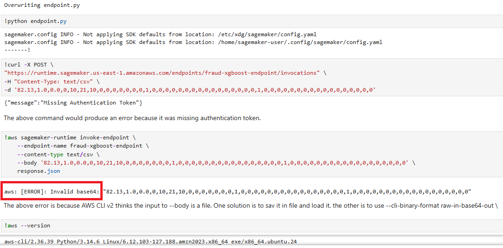
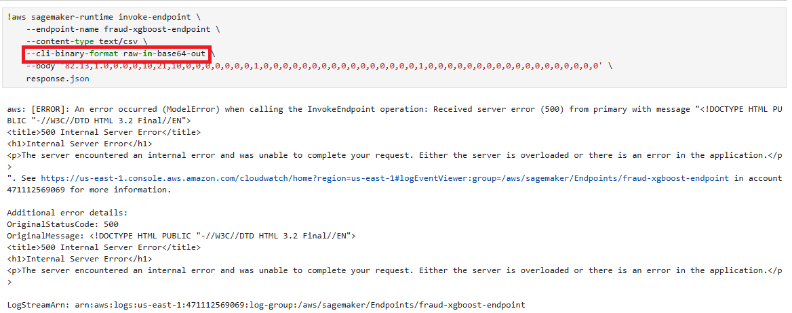
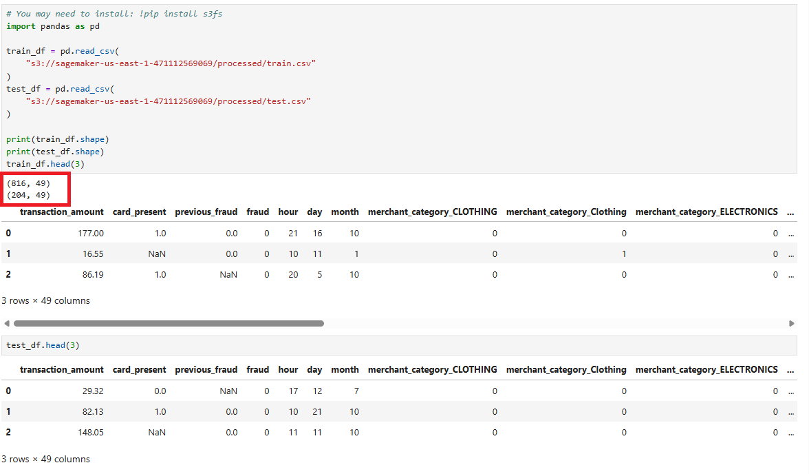
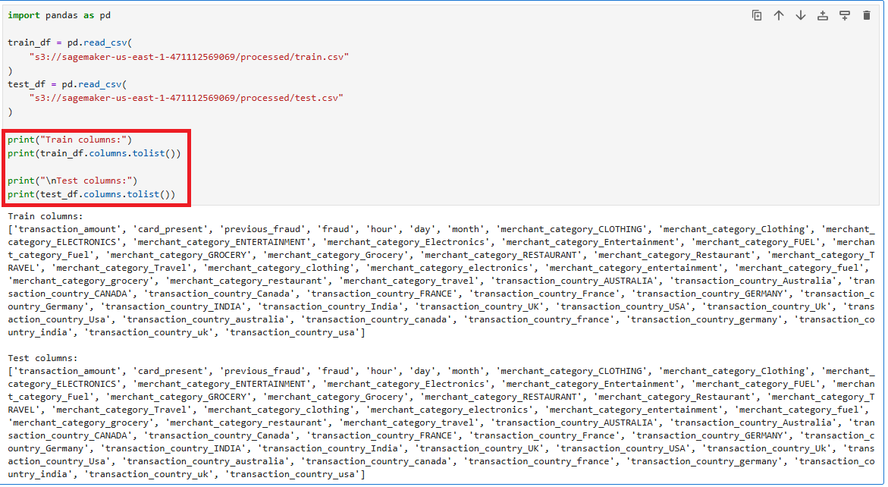
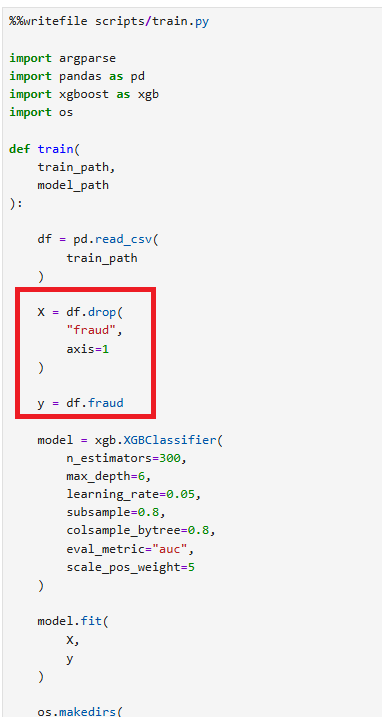
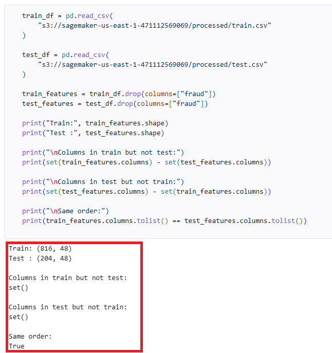

# Project Structure

```

fraud-sagemaker-mlops/
│
├── README.md
├── requirements.txt
│
├── config.py
│
├── pipeline.py
│
├── scripts/
│   │
│   ├── preprocess.py
│   ├── train.py
│   ├── evaluate.py
│   └── inference.py
│
├── deployment/
│   └── deploy_endpoint.py
│
└── data/
	└── raw
		└── fraud_transactions_dataset.csv

```

# Troubeshooting

## Testing the endpoint 

Tesiting the endpoint did not work because of the data format of the test input.
- do the number of features in train and test match?
- do the features and their order in trani/test match?
- is the input in the correct format that the endpoint/model expects? E.g., if endpoint expects csv and you input json?

You may use the following code in your troubleshooting?

```python
import pandas as pd

train_df = pd.read_csv("train.csv")
test_df = pd.read_csv("test.csv")

print("Train columns:")
print(train_df.columns.tolist())

print("\nTest columns:")
print(test_df.columns.tolist())
```
See also the following images:







